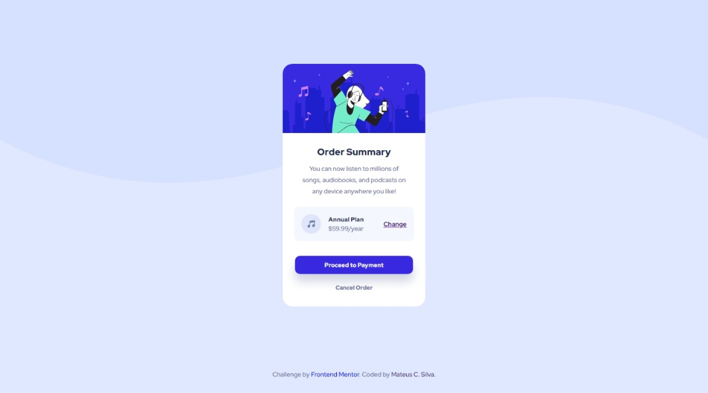

# Frontend Mentor - Order summary card solution

This is a solution to the [Order summary card challenge on Frontend Mentor](https://www.frontendmentor.io/challenges/order-summary-component-QlPmajDUj). Frontend Mentor challenges help you improve your coding skills by building realistic projects. 

## Mobile

## Desktop

### Links
- Live Site URL: [Add live site URL here](https://mateuscamargos-1.github.io/Frontend-Mentor---Order-summary-card-solution/)

### Built with

- Semantic HTML5 markup
- CSS custom properties
- Flexbox
- Mobile-first workflow

## Author
- Frontend Mentor - [@MateusCamargoS-1](https://www.frontendmentor.io/profile/MateusCamargoS-1)
- LinkedIn - [@MateusCamargodaSilva](https://www.linkedin.com/in/mateus-camargo-da-silva-2b8610215/)
